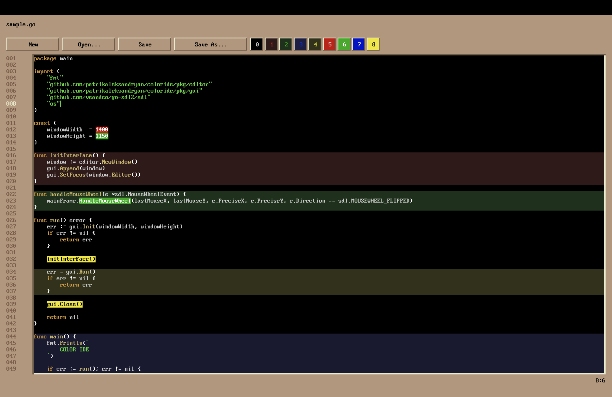

# ColorIDE

**ColorIDE** is an experimental text editor with manual color markup for source code, developed as part of a master's thesis at the University of Latvia. The goal of the project is to improve the perception and readability of source code by introducing additional layers of color-based semantics, independent of syntax highlighting.



## Core Concept

Most modern editors rely on automatic syntax highlighting based on the programming language. **ColorIDE** introduces a novel concept: manually inserted color markers stored directly in the source code via special comments. This enables:

- Compatibility with version control tools (`git`, `diff`)
- Interoperability with other editors and platforms
- A new visual communication channel between developers

## Technologies

- **Programming language:** Go
- **Graphics library:** SDL2
- **Color format support:** custom format stored in `///` comments
- **Cross-platform:** Windows, Linux, macOS

## Example of Color Encoding

```go
fmt.Println("Hello, world!") ///6:11G 13:18R
```

In this example, `"Hello"` is highlighted in green and `"world"` in red.

## Comment Format

Color markup is recorded as inline comments:
```
///start:lengthColor
```

Color codes:
- `r`, `g`, `b`, `y` — soft tones
- `R`, `G`, `B`, `Y` — bright tones

## Architecture

The editor consists of the following modules:
- `editor` — file and editor logic
- `gui` — graphical interface using SDL2
- `text` — internal structure of editable content with color annotations
- `syntax` — basic Go syntax highlighter

Features:
- Manual color block annotations
- Preserved syntax highlighting
- Cursor tracking, line numbers, and indentation visualization

## TODO / Future Work

- Multi-language syntax support
- Theme customization
- Dynamic annotations and overlays
- Visual editing of color metadata

---

Developed as part of a Master's degree at the University of Latvia, 2025  
Author: **Patriks Aleksandrjans**  
Supervisor: **Prof. Juris Vīksna**

# Build info

## Build on Mac

```
brew install sdl2 sdl2_image sdl2_ttf sdl2_mixer
```

Install Go.

Then:
```
make
```


## Notes

If compiled on Mac, you may see this warning:
```
ld: warning: ignoring duplicate libraries: '-lSDL2', '-lSDL2_ttf'
```
This does not affect the application, but you can add to your `.zprofile`:
```
export CGO_LDFLAGS="-Wl,-no_warn_duplicate_libraries"
```

